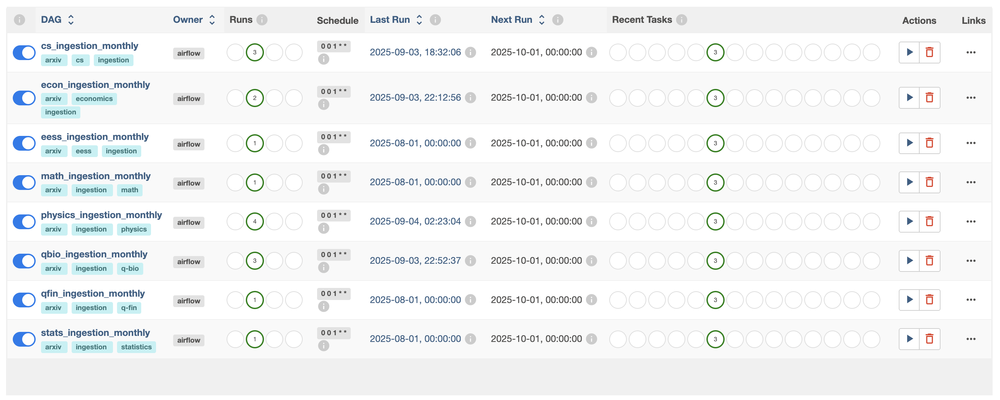

## End to End RAGops 

### Data-Pipeline 
- Ingestion from arXiv API -> Google Cloud (data-lake) -> Google BigQuery (data-warehouse) 
- Using airflow to set up schedule data pipeline from arXiv API -> Google Cloud 
