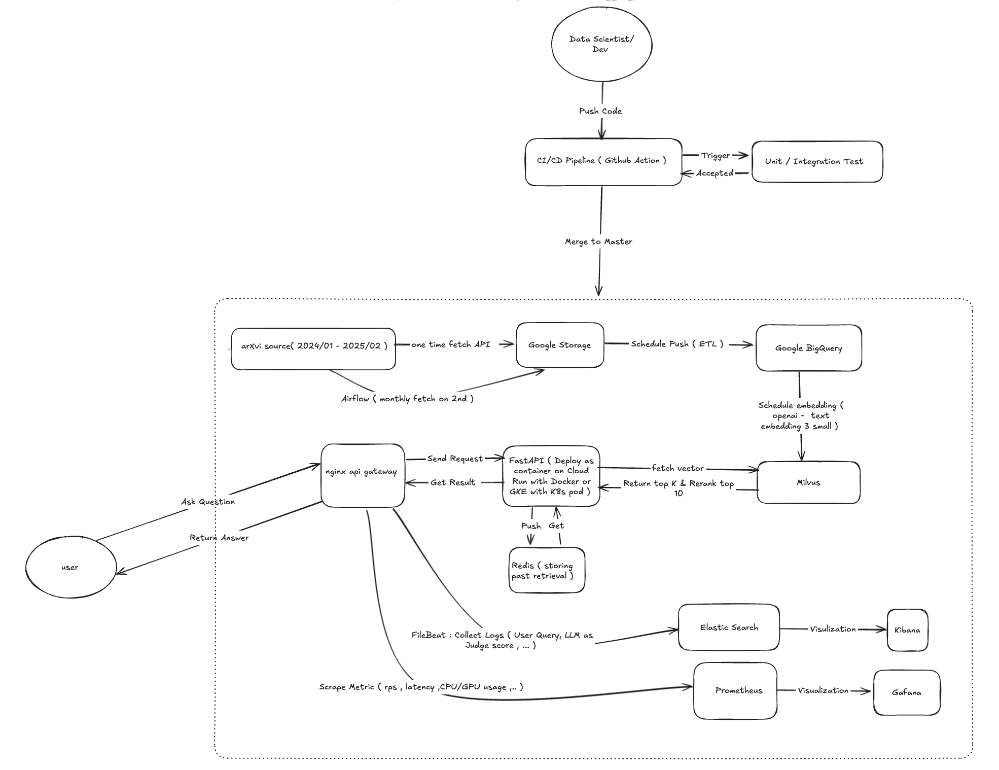
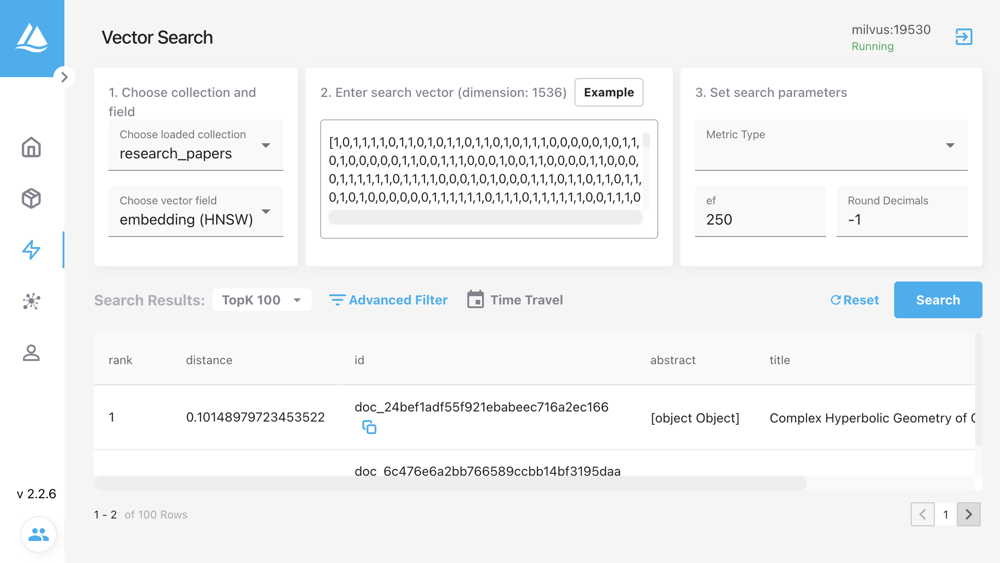
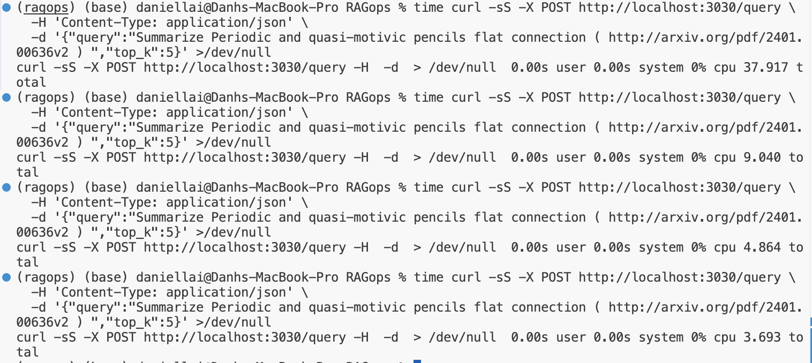

## End to End RAGops ( Not Finish ) 


### Architecture 



### Continuous improvement

Future Improvement : 
- Sematic Caching ( Redis ) 
- Deploy on GKE or Cloud-Run ( only for the RAGsystem , not for others services ) 
- prometheus direct scraping metrics from application and Gafana to monitoring
- Github Action for CICD (write function test and Ingeration testing ) 

Maybe : 
- LLM Graudrails 
- Load-balancing and Rarelimit design 
- Terraform for automate Google Cloud deployment 


### Data-Pipeline  : Ingestion from arXiv API -> Google Cloud (data-lake) -> Google BigQuery (data-warehouse) 


#### Airflow Pipeline 
- Using airflow to set up schedule data pipeline from arXiv API -> Google Cloud 
 


#### Google Cloud Storage (Data Lake - Gold layers)
1/ Big Load & Monthly Load from arXiv API pipeline -> Storage 
 

- The cs_date_date.parquet is the chunk loading from ( 2024-01-01 - 2025-09-01)
- The cs_latest.parquet or econ_latest.parquet are monthly recurring load 


#### Google BigQuery (Data Warehose - Silver layers) 
1/ Data Transfer From Cloud. Storage to update monthly 


2/ Schedule ETL Queries ( remove duplicate fixing datetime)


3/ Table view 


### Model-Pipeline for RAG system 

- **Data Ingestion**: Retrieves research paper data from Google BigQuery ( Optional : adding airflow from Google Big Query -> Milvus ( Vector DB ) every month  or run on bash:  curl -s -X POST http://localhost:3030/ingest | jq ( adding new monthly data in ) ) 

- **Vector Storage**: Uses Milvus as a vector database
- **Embedding**: Uses OpenAI's text-embedding-3-small 
- **Retrieval**: Fast vector similarity search using Milvus
- **Reranking**: Semantic reranking with Cohere
- **Answer Generation**: Synthesizes information with OpenAI's GPT-4.1
- **Evaluation**: Automatic evaluation of responses for hallucination, truthfulness, accuracy, and relevancy
- **Metadata Enrichment**: Extracts additional paper metadata from URLs 

#### Example Query & Response

#### Data Ingestion from Google Big Query into Milvus 

This is an example :


Accessing : localhost:3030/docs/query

Below is a real summarize-mode example (query starts with `summarize ... (pdf_url)`), showing unified retrieval + rerank + summarization + LLM evaluation output structure.

Request (POST /query):
```json
{
	"query": "summarize Empowering Biomedical Discovery with AI Agents (http://arxiv.org/pdf/2404.02831v2)",
	"top_k": 5,
	"get_metadata": false
}
```

Response (truncated for readability):
```json
{
  "query": "summarize LLMs are Bayesian, in Expectation, not in Realization (http://arxiv.org/pdf/2507.11768v1 ) ",
  "answer": "**Summary of \"LLMs are Bayesian, in Expectation, Not in Realization\"**\nThis paper addresses a paradox in the theoretical understanding of large language models (LLMs), such as GPT-3: while these models demonstrate in-context learning (ICL) abilities that resemble Bayesian inference, recent empirical work shows they systematically violate the martingale property—a fundamental requirement for Bayesian updating on exchangeable data. This contradiction challenges the use of LLMs for uncertainty quantification in critical applications.",
  "papers": [
    {
      "id": "doc_4b25bf017058d5b8a7d60317bdea29f3",
      "title": "LLMs are Bayesian, in Expectation, not in Realization",
      "authors": "",
      "abstract": "LLMs are Bayesian,\nIn Expectation, Not in Realization\nLeon Chlon\nHassana Labs\nleo@hassana.io\nSarah Rashidi\nHassana Labs\nsarah@hassana.io\nZein Khamis\nHassana Labs\nzein@hassana.io\nMarcAntonio M. Awada\nHarvard University\nmawada@hbs.edu\nAbstract\nLarge language models demonstrate remarkable in-context learning capabilities,\nadapting to new tasks without parameter updates. While this phenomenon has been\nsuccessfully modeled as implicit Bayesian inference, recent empirical findings\nreveal a fundamental contradiction: transformers systematically violate the martin-\ngale property, a cornerstone requirement of Bayesian updating on exchangeable\ndata. This violation challenges the theoretical foundations underlying uncertainty\nquantification in critical applications.\nWe resolve this paradox through an information-theoretic framework that reconciles\narchitectural constraints with statistical optimality. We prove that positional encod-\nings fundamentally alter the learning problem: transformers minimize expected\nconditional Kolmogorov complexity Eπ[K(X|π)] over permutations rather than\nthe exchangeable complexity K(X). This distinction explains how transformers\ncan simultaneously violate martingale properties while achieving Bayesian-level\ncompression efficiency.\nOur theoretical analysis establishes four key results: (1) positional encodings induce\nmartingale violations of order Θ(log n/n); (2) transformers achieve information-\ntheoretic optimality with excess risk O(n−1/2) in expectation over orderings; (3)\nthe implicit posterior representation converges to the true Bayesian posterior in the\nspace of sufficient statistics; and (4) we derive the optimal chain-of-thought length\nas k∗= Θ(√n log(1/ε)) with explicit constants, providing a principled approach\nto reduce inference costs while maintaining performance. Empirical validation on\nGPT-3 confirms predictions (1)-(3), with transformers reaching 99% of theoretical\nentropy limits within 20 examples. Our framework provides practical methods for\nextracting calibrated uncertainty estimates from position-aware architectures and\noptimizing computational efficiency in deployment.\n1\nIntroduction\nThe emergence of in-context learning (ICL) represents a paradigm shift in machine learning. Large\nlanguage models, exemplified by GPT-3 [2], can adapt to novel tasks using only a few examples\nprovided at inference time, without any gradient-based parameter updates. This capability has\nprofound implications for few-shot learning, task adaptation, and the fundamental nature of learning\nin neural networks.\n1.1\nThe Bayesian Framework and Its Success\nA particularly elegant theoretical framework interprets ICL through the lens of Bayesian inference.\n[17] proposed that transformers implicitly perform posterior updates over a latent concept variable,\nwith the pretraining distribution encoding a prior over possible tasks. This perspective has been\narXiv:2507.11768v1  [stat.ML]  15 Jul 2025\n\nextended to show that transformers can implement optimal statistical procedures [1], approximate\nGaussian processes [9], and achieve minimax-optimal regret bounds [19].\nThe Bayesian interpretation provides both conceptual clarity and practical benefits. It suggests\nprincipled approaches to uncertainty quantification, explains the sample efficiency of few-shot\nlearning, and connects ICL to the rich literature on meta-learning and statistical estimation theory.\nThe framework’s predictive success has made it a cornerstone of our theoretical understanding of\ntransformer capabilities.\n1.2\nThe Martingale Violation Challenge\nHowever, this theoretical edifice was recently challenged by [3], who demonstrated empirically that\ntransformer-based language models systematically violate the martingale property. For exchangeable\ndata where the order of observations carries no information, Bayesian posterior predictive distributions\nmust satisfy:\nE[f(Xn+1)|X1, . . . , Xn] = E[f(Xn+1)|Xπ(1), . . . , Xπ(n)]\n(1)\nfor any permutation π and bounded function f. This property is not a technical detail but a funda-\nmental mathematical consequence of Bayesian updating.\nTheir experiments on GPT-3.5, GPT-4, Llama-2, and other state-of-the-art models revealed consistent\nviolations across multiple statistical tests. These findings pose a serious challenge: if transformers\nviolate the martingale property, can they truly be performing Bayesian inference? The implications\nextend beyond theoretical aesthetics to practical applications in medicine, finance, and other domains\nwhere calibrated uncertainty estimates are critical.\n1.3\nOur Contribution: An Information-Theoretic Resolution\nWe propose that this apparent contradiction can be resolved by adopting an algorithmic information\ntheory perspective. Our key insight is that positional encodings, which are ubiquitous in transformer\narchitectures, fundamentally alter the information-theoretic structure of the learning problem. While\nclassical Bayesian inference assumes exchangeable data, positional encodings explicitly break this\nsymmetry by making the model’s computations depend on the order of inputs.\nWe formalize this through the distinction between two complexity measures:\n• The Kolmogorov complexity K(X) of a sequence, which is permutation-invariant for\nexchangeable data\n• The conditional complexity K(X|π) given a specific ordering π\nWe prove that transformers with positional encodings minimize:\nEπ∼U(Sn)[K(X|π)] = K(X) + I(X; π)\n(2)\nwhere U(Sn) denotes the uniform distribution over permutations consistent with sufficient statistics,\nand I(X; π) represents the mutual information between sequences and their orderings.\nThis formulation reveals why transformers can simultaneously:\n1. Violate martingale properties (which require identical behavior across all orderings)\n2. Achieve near-optimal compression rates characteristic of Bayesian inference\n3. Implement implicit posterior representations in the space of sufficient statistics\n1.4\nSummary of Results\nOur main contributions are:\n1. Theoretical Reconciliation: We provide the first rigorous explanation for the coexistence of\nmartingale violations and Bayesian-like behavior. We quantify martingale violations as Θ(log n/n)\nand prove that transformers achieve Minimum Description Length (MDL) optimality with excess risk\nO(n−1/2).\n2\n\n2. Information-Theoretic Framework: We establish that transformers are \"Bayesian in expectation,\nnot in realization.\" They achieve optimal compression when averaged over orderings while necessarily\nviolating exchangeability for any specific ordering due to architectural constraints.\n3. Optimal Chain-of-Thought Length: We derive a closed-form expression for the optimal number\nof intermediate reasoning tokens: k∗= Θ(√n log(1/ε)) with explicit constants. This result has\nimmediate practical implications for reducing inference costs, which is a critical concern as chain-of-\nthought prompting becomes standard practice but can increase computational expenses by 10-100×\nper query. Moreover, we prove an incompleteness theorem showing that chain-of-thought is not just\nuseful but theoretically necessary for transformers to compute functions with complexity exceeding\ntheir parameter count.\n4. Empirical Validation: Through experiments on GPT-3, we demonstrate that:\n• Martingale violations follow our predicted Θ(log n/n) scaling with R2 > 0.75\n• Transformers reach 99% of theoretical entropy limits within 20 examples\n• Position-dependent processing enhances rather than hinders statistical efficiency\n5. Practical Algorithms: We provide concrete methods for extracting calibrated uncertainty esti-\nmates:\n• Permutation averaging achieves 4× variance reduction with k ≈20 shuffles\n• Sufficient statistic conditioning reduces position bias by ≈85%\n• Debiasing techniques can mitigate periodic artifacts from rotary embeddings\n• Algorithm for computing optimal CoT length with stability guarantees\n1.5\nPaper Organization\nSection 2 reviews the relevant background on in-context learning, Bayes",
      "url": "",
      "score": 0.99999297,
      "metadata": null
    },
    {
      "id": "doc_5194e79a4d5bc586eeaec2f5368aa44b",
      "title": "BED-LLM: Intelligent Information Gathering with LLMs and Bayesian   Experimental Design",
      "authors": "",
      "abstract": "",
      "url": "",
      "score": 0.9305845,
      "metadata": null
    },
    {
      "id": "doc_0e15ce50c461d837f9fc805e77f640fb",
      "title": "Bayesian Concept Bottleneck Models with LLM Priors",
      "authors": "",
      "abstract": "",
      "url": "",
      "score": 0.31943974,
      "metadata": null
    },
    {
      "id": "doc_d676e28174b1e7bc6292ec23923d3cfc",
      "title": "Textual Bayes: Quantifying Uncertainty in LLM-Based Systems",
      "authors": "",
      "abstract": "",
      "url": "",
      "score": 0.2654994,
      "metadata": null
    },
    {
      "id": "doc_40c25732f30b2e05ec11fa9abbce4495",
      "title": "Understanding LLMs: A Comprehensive Overview from Training to Inference",
      "authors": "",
      "abstract": "",
      "url": "",
      "score": 0.1334152,
      "metadata": null
    },
    {
      "id": "doc_b7932d9b6cab28632ad818ab811f50e0",
      "title": "Simulating Macroeconomic Expectations using LLM Agents",
      "authors": "",
      "abstract": "",
      "url": "",
      "score": 0.08897849,
      "metadata": null
    },
    {
      "id": "doc_a4e30c20e544214b866ca9b9698ff5a8",
      "title": "Predictive Power of LLMs in Financial Markets",
      "authors": "",
      "abstract": "",
      "url": "",
      "score": 0.0153063545,
      "metadata": null
    },
    {
      "id": "doc_988b89520e7eeaad6742d8ac8cb6e0f3",
      "title": "Rational Expectations in Empirical Bayes",
      "authors": "",
      "abstract": "",
      "url": "",
      "score": 0.011331754,
      "metadata": null
    },
    {
      "id": "doc_60dcb239ce3e630d58cfe3068cade96e",
      "title": "Position: Understanding LLMs Requires More Than Statistical   Generalization",
      "authors": "",
      "abstract": "",
      "url": "",
      "score": 0.008677716,
      "metadata": null
    },
    {
      "id": "doc_7d4c27b49ebf30c709324a8a9a3f6139",
      "title": "LLM Processes: Numerical Predictive Distributions Conditioned on Natural   Language",
      "authors": "",
      "abstract": "",
      "url": "",
      "score": 0.008251599,
      "metadata": null
    }
  ],
  "evaluation": {
    "hallucination_score": 10,
    "truthfulness_score": 10,
    "accuracy_score": 9,
    "relevancy_score": 10,
    "explanation": "{\"Hallucination\":{\"score\":10,\"explanation\":\"The answer accurately summarizes the main points and findings of the referenced paper without introducing information not present in the provided document.\"},\"Truthfulness\":{\"score\":10,\"explanation\":\"All claims in the summary are directly supported by the abstract and introduction of the paper, including the explanation of martingale violations, the expectation vs. realization distinction, and empirical validation.\"},\"Accuracy\":{\"score\":9,\"explanation\":\"The summary is highly accurate, capturing the theoretical and empirical contributions, but the last bullet point is cut off and does not fully detail the practical algorithms, which are present in the source.\"},\"Relevancy\":{\"score\":10,\"explanation\":\"The answer is fully relevant to the query, focusing exclusively on summarizing the specified paper and its main findings.\"},\"OverallComment\":\"A faithful, concise, and well-structured summary that covers the core contributions and findings of the paper. Minor deduction for the incomplete final point, but overall the answer is highly reliable and relevant.\"}"
  },
  "summary": "**Summary of \"LLMs are Bayesian, in Expectation, Not in Realization\"**\n\nThis paper addresses a paradox in the theoretical understanding of large language models (LLMs), such as GPT-3: while these models demonstrate in-context learning (ICL) abilities that resemble Bayesian inference, recent empirical work shows they systematically violate the martingale property—a fundamental requirement for Bayesian updating on exchangeable data. This contradiction challenges the use of LLMs for uncertainty quantification in critical applications.\n\n**Key Contributions and Findings:**\n\n1. **Martingale Violations Explained:**  \n   The authors show that transformer architectures, due to their use of positional encodings, break the exchangeability assumption required for the martingale property. Instead of treating all input orderings equally (as Bayesian inference does), transformers process data in a position-dependent way, leading to systematic martingale violations of order Θ(log n/n).\n\n2. **Bayesian in Expectation, Not in Realization:**  \n   Despite these violations, transformers achieve near-optimal information-theoretic performance when averaged over all possible input orderings. Specifically, they minimize the expected conditional Kolmogorov complexity Eπ[K(X|π)] (averaged over permutations), rather than the permutation-invariant complexity K(X). Thus, LLMs are \"Bayesian in expectation\"—they match Bayesian optimality on average, but not for any specific ordering.\n\n3. **Optimal Chain-of-Thought (CoT) Length:**  \n   The paper derives a closed-form expression for the optimal number of intermediate reasoning steps (CoT tokens) as k* = Θ(√n log(1/ε)), providing a principled way to balance inference cost and performance. It also proves that CoT is theoretically necessary for transformers to compute functions more complex than their parameter count.\n\n4. **Empirical Validation:**  \n   Experiments on GPT-3 confirm the theoretical predictions:\n   - Martingale violations scale as predicted.\n   - Transformers reach 99% of theoretical entropy limits within 20 examples.\n   - Position-dependent processing enhances statistical efficiency.\n\n5. **Practical Algorithms for Uncertainty and Efficiency:**  \n   The authors propose methods to extract calibrated uncertainty estimates and reduce computational costs:\n   - Perm",
  "ranking": [
    {
      "rank": 1,
      "id": "doc_4b25bf017058d5b8a7d60317bdea29f3",
      "title": "LLMs are Bayesian, in Expectation, not in Realization",
      "score": 0.99999297
    },
    {
      "rank": 2,
      "id": "doc_5194e79a4d5bc586eeaec2f5368aa44b",
      "title": "BED-LLM: Intelligent Information Gathering with LLMs and Bayesian   Experimental Design",
      "score": 0.9305845
    },
    {
      "rank": 3,
      "id": "doc_0e15ce50c461d837f9fc805e77f640fb",
      "title": "Bayesian Concept Bottleneck Models with LLM Priors",
      "score": 0.31943974
    },
    {
      "rank": 4,
      "id": "doc_d676e28174b1e7bc6292ec23923d3cfc",
      "title": "Textual Bayes: Quantifying Uncertainty in LLM-Based Systems",
      "score": 0.2654994
    },
    {
      "rank": 5,
      "id": "doc_40c25732f30b2e05ec11fa9abbce4495",
      "title": "Understanding LLMs: A Comprehensive Overview from Training to Inference",
      "score": 0.1334152
    },
    {
      "rank": 6,
      "id": "doc_b7932d9b6cab28632ad818ab811f50e0",
      "title": "Simulating Macroeconomic Expectations using LLM Agents",
      "score": 0.08897849
    },
    {
      "rank": 7,
      "id": "doc_a4e30c20e544214b866ca9b9698ff5a8",
      "title": "Predictive Power of LLMs in Financial Markets",
      "score": 0.0153063545
    },
    {
      "rank": 8,
      "id": "doc_988b89520e7eeaad6742d8ac8cb6e0f3",
      "title": "Rational Expectations in Empirical Bayes",
      "score": 0.011331754
    },
    {
      "rank": 9,
      "id": "doc_60dcb239ce3e630d58cfe3068cade96e",
      "title": "Position: Understanding LLMs Requires More Than Statistical   Generalization",
      "score": 0.008677716
    },
    {
      "rank": 10,
      "id": "doc_7d4c27b49ebf30c709324a8a9a3f6139",
      "title": "LLM Processes: Numerical Predictive Distributions Conditioned on Natural   Language",
      "score": 0.008251599
    }
  ]
}
```

Key fields:
- `answer`: Concise 1–2 section opening lines for quick preview.
- `summary`: Full structured multi-section summary (Problem, Methods, Key Results, Interpretation, Limitations & Future Work).
- `papers`: Top reranked context documents (Milvus vector search → Cohere rerank) with relevance scores.
- `ranking`: Explicit ordered list mirroring `papers` for lightweight consumers.
- `evaluation`: Automatic LLM-as-judge quality assessment (hallucination, truthfulness, accuracy, relevancy) on the scale of 0 (worst) - 10 (best) .

Notes:
- When no abstract is stored, system fetches PDF (arXiv or direct .pdf) and summarizes first pages (truncated) with a truncation note.
- Incremental ingestion (monthly) reuses deterministic IDs; unchanged papers are skipped.
- Summarize mode is triggered by leading `summarize` keyword in the query. 


### ElasticSearch 

#### Discovery Logs
Collecting logs from RAG-system (query , LLM-as-judge scoring , cohere re-ranker score ,... ) using Filebeat 

 

#### Kibana Analytics 


### Sematic Cache ( Redis ) 

#### Verify if the cache hit 
In the image below, The first query tooks around 39s , the second query take around 9 second, the third query takes 4.8s and it keeps reducing the time . The reason it is not ms second because it has to go through the eval response in the LLM as judge if we remove that it able to achieve the ms speed. 




### Localhost Redis 


