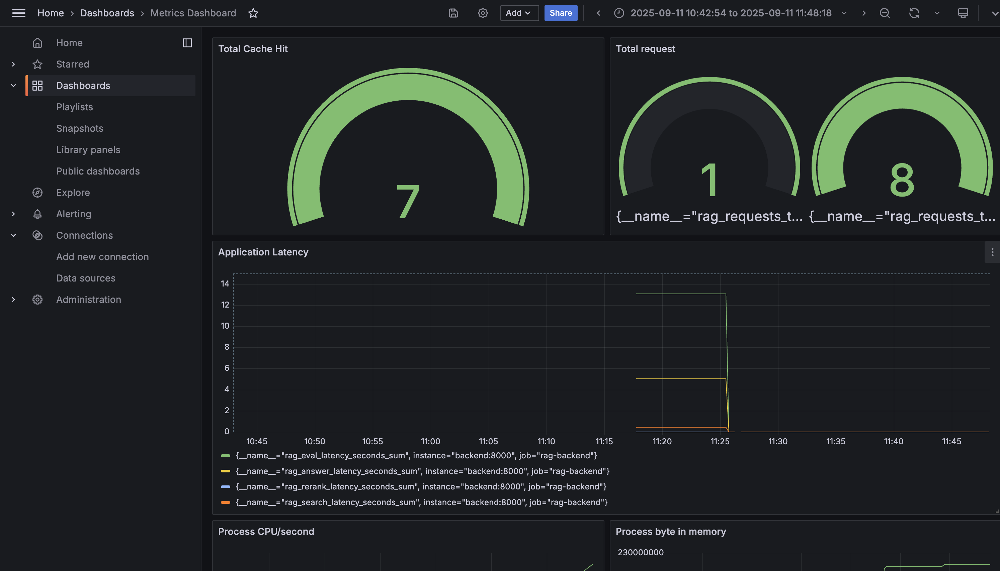

## End to End RAGops


### Architecture 
## RAGops: End‑to‑End Retrieval‑Augmented Generation Platform

This repository contains a production‑oriented RAG stack: data ingestion from arXiv → GCS → BigQuery, vectorization into Milvus, a FastAPI backend with reranking and LLM generation, semantic caching with Redis, and full observability (Prometheus, Elasticsearch/Kibana, Grafana) plus CI/CD.

### Architecture


At a glance:
- Data pipeline brings raw papers into Google Cloud Storage (data lake) and curates them into BigQuery (warehouse).
- Model pipeline embeds/ingests into Milvus, retrieves + reranks (Cohere), then synthesizes an answer (OpenAI) with LLM‑as‑judge evaluation.
- API is exposed via FastAPI (local or Cloud Run). Optional Redis provides semantic cache.
- Logs/metrics flow to the observability stack.

---

### Presentation

[▶️ Watch on GitHub (with audio)](https://github.com/danhdanhtuan0308/RAGops/blob/main/images/presentation_web.mp4)


## Data Pipeline (arXiv → GCS → BigQuery)

### Airflow Pipeline
- Airflow schedules and runs the arXiv → GCS pipeline.


### Google Cloud Storage (Data Lake – Gold)
- Bulk/recurring loads land as Parquet in GCS.

- Notes: `cs_date_date.parquet` is a historical chunk (2024‑01‑01 → 2025‑09‑01). `cs_latest.parquet`, `econ_latest.parquet` are monthly loads.

### Google BigQuery (Data Warehouse – Silver)
1) Transfer from GCS on schedule.

2) Scheduled ETL removes duplicates and cleans time fields.

3) Final table view powering retrieval.


---

## Model Pipeline (Milvus, Cohere, OpenAI)
- Vector DB: Milvus stores `text-embedding-3-small` vectors and metadata.
- Retrieval: Milvus HNSW search for candidate documents using Hybrid Search BM25 + Cosine.
- Reranking: Cohere Rerank v3.0 for semantic ordering.
- Answering: OpenAI GPT‑4.1 variants synthesize answers.
- Evaluation: LLM‑as‑judge produces hallucination/truthfulness/accuracy/relevancy scores.

Data Ingestion from BigQuery into Milvus (example)


---

## Getting Started

### Prerequisites
- Python 3.11+ (for local dev)
- Docker + Docker Compose (for local stack)
- gcloud CLI (for Cloud Run)

### Option A: Local quickstart (API only)
Run the API against a hosted Milvus (e.g., Zilliz Cloud) and your API keys.
```zsh
cd backend
python -m venv .venv && source .venv/bin/activate
pip install -r requirements.txt

export OPENAI_API_KEY=... 
export COHERE_API_KEY=...
export MILVUS_URI='https://<your-zilliz-endpoint>:19530'
export MILVUS_TOKEN='...'
export MILVUS_SECURE=true

uvicorn app:app --host 0.0.0.0 --port 3030
```
Open API docs: http://localhost:3030/docs

### Option B: Local full stack (Docker Compose)
Bring up Milvus/Redis and the backend locally.
```zsh
cd backend
docker compose -f docker-compose.yml up -d etcd minio milvus redis backend
```
Health checks:
```zsh
curl -s http://localhost:3030/status | jq .
```

### Deploy to Cloud Run (FastAPI only)
Build and deploy just the backend (Milvus/Redis remain external/optional).
```zsh
cd backend
export PROJECT_ID=<your-project>
export REGION=us-central1
export OPENAI_API_KEY=...
export COHERE_API_KEY=...
# Zilliz/hosted Milvus
export MILVUS_URI='https://<your-zilliz-endpoint>:19530'
export MILVUS_TOKEN='...'
export MILVUS_SECURE=true

bash deploy/cloud-run.sh
```
After deploy, find the URL:
```zsh
SERVICE_URL=$(gcloud run services describe ragops-backend \
  --region ${REGION} --format='value(status.url)')
open "$SERVICE_URL/docs"
```

---

## Using the Platform

### Ingestion (BigQuery → Milvus)
- Start ingestion:
```zsh
curl -s -X POST "$SERVICE_URL/ingest" | jq .
```
- Check progress:
```zsh
curl -s "$SERVICE_URL/ingest/status" | jq .
```
Fields:
- `running`: background ingest active
- `total`: number of rows considered in this run (may differ from final unique count)
- `inserted`: successfully inserted rows so far

Notes:
- IDs are deterministic SHA1(title||abstract), so duplicates are skipped.
- If running on Cloud Run, enable CPU always allocated during ingest for steady progress:
```zsh
gcloud run services update ragops-backend --region ${REGION} \
  --no-cpu-throttling --min-instances=1 --timeout=1800
```
Optionally throttle embeddings:
```zsh
gcloud run services update ragops-backend --region ${REGION} \
  --update-env-vars EMBED_BATCH_SIZE=8,OPENAI_EMBED_MAX_RETRIES=6,OPENAI_EMBED_RETRY_BASE_SLEEP=2
```

### Querying
- Standard RAG mode:
```zsh
curl -s "$SERVICE_URL/query" \
  -H 'Content-Type: application/json' \
  -d '{"query":"What are recent LLM uncertainty methods?","top_k":5}' | jq .
```
- Summarize mode (prefix query with `summarize` and optionally include a PDF URL):
```zsh
curl -s "$SERVICE_URL/query" \
  -H 'Content-Type: application/json' \
  -d '{"query":"summarize Empowering Biomedical Discovery with AI Agents (http://arxiv.org/pdf/2404.02831v2)","top_k":5}' | jq .
```

### Health and Metrics
- Health/status:
```zsh
curl -s "$SERVICE_URL/status" | jq .
```
- Prometheus metrics:
```zsh
curl -s "$SERVICE_URL/metrics"
```

---

## Observability

### Elasticsearch + Kibana (Logs)
Structured logs capture queries, rankings, and evaluation signals.


### Prometheus (Metrics)
FastAPI exports Prometheus metrics directly.


### Grafana (Dashboards)
RPS, CPU, cache hits, and more.


---

## Semantic Cache (Redis)
- Speeds up repeated queries using embedding‑aware semantic matching.
- Configure with `REDIS_HOST` / `REDIS_PORT`.
- Example cache effect (lower latency on repeated queries):


---

## CI/CD Pipeline

### Tests
- Unit tests: deduplication, chunking, Cohere top‑K, basic accuracy checks.
- Integration tests: API keys presence, library compatibility.

### GitHub Runner & Local Deploy

Local auto‑deploy via GitHub Actions runner:


### Deploy on Cloud-Run 
Local auto‑deploy via GitHub Actions runner:


---

## Cloud Run
Deployed on Cloud Run with 100% traffic directed to the latest healthy revision.


---

## Troubleshooting
- Service won’t start: `OPENAI_API_KEY` or `COHERE_API_KEY` missing.
  - Fix by updating env vars on the service:
  ```zsh
  gcloud run services update ragops-backend --region ${REGION} \
    --update-env-vars OPENAI_API_KEY=...,COHERE_API_KEY=...
  ```
- Milvus not connected: set Zilliz/hosted Milvus vars (include `:19530`).
  ```zsh
  gcloud run services update ragops-backend --region ${REGION} \
    --update-env-vars MILVUS_URI='https://<endpoint>:19530',MILVUS_TOKEN='...',MILVUS_SECURE=true
  ```
- Ingestion stuck at 0 on Cloud Run: enable `--no-cpu-throttling` and set `--min-instances=1` during ingest.
- Fewer rows than BigQuery: deduplication by deterministic ID is working as intended.
- Rate limits on embeddings: lower `EMBED_BATCH_SIZE`, raise retries/backoff.

---

## Missing piece , need to improve 

- Build a golden-dataset for evaluation 
- Split each services in each container and using k8s to manage those 
- Rare-limit design and Load balancer 

