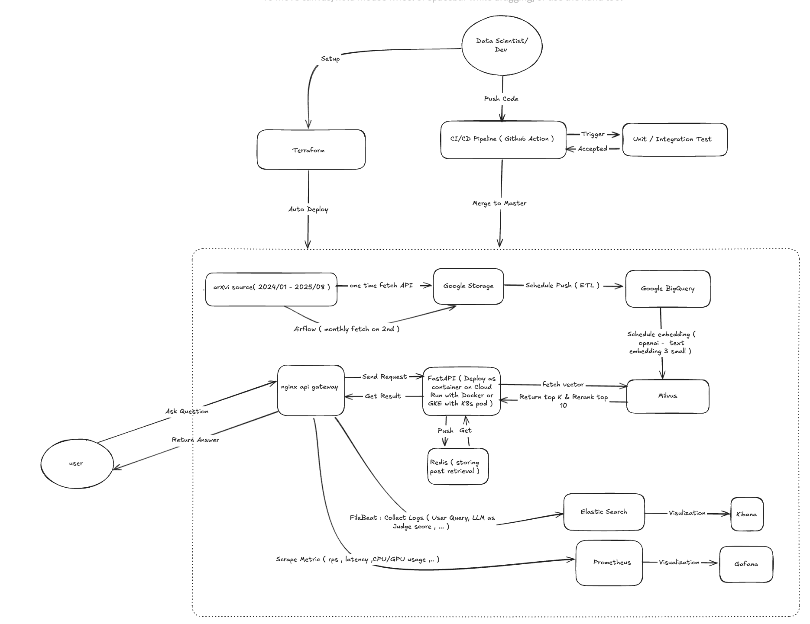
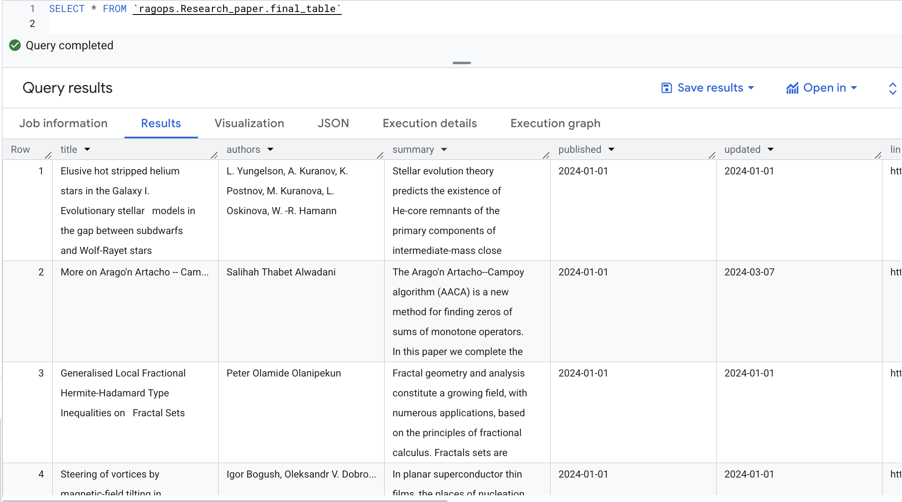

## End to End RAGops


### Architecture 
## RAGops: End‑to‑End Retrieval‑Augmented Generation Platform

This repository contains a production‑oriented RAG stack: data ingestion from arXiv → GCS → BigQuery, vectorization into Milvus, a FastAPI backend with reranking and LLM generation, semantic caching with Redis, and full observability (Prometheus, Elasticsearch/Kibana, Grafana) plus CI/CD.

### Architecture

At a glance:
- Data pipeline brings raw papers into Google Cloud Storage (data lake) and curates them into BigQuery (warehouse).
- Model pipeline embeds/ingests into Milvus, retrieves + reranks (Cohere), then synthesizes an answer (OpenAI) with LLM‑as‑judge evaluation.
- API is exposed via FastAPI (local or Cloud Run). Optional Redis provides semantic cache.
- Logs/metrics flow to the observability stack.
- URL Link to try out https://ragops-backend-642058528914.us-central1.run.app
---

### Presentation

[▶️ Watch on GitHub (with audio)](https://github.com/danhdanhtuan0308/RAGops/blob/main/images/presentation_web.mp4)


## Data Pipeline (arXiv → GCS → BigQuery)

### Airflow Pipeline
- Airflow schedules and runs the arXiv → GCS pipeline.


### Google Cloud Storage (Data Lake – Gold)
- Bulk/recurring loads land as Parquet in GCS.

- Notes: `cs_date_date.parquet` is a historical chunk (2024‑01‑01 → 2025‑09‑01). `cs_latest.parquet`, `econ_latest.parquet` are monthly loads.

### Google BigQuery (Data Warehouse – Silver)
1) Transfer from GCS on schedule.

2) Scheduled ETL removes duplicates and cleans time fields.

3) Final table view powering retrieval.


---

## Model Pipeline (Milvus, Cohere, OpenAI)
- Vector DB: Milvus stores `text-embedding-3-small` vectors and metadata.
- Retrieval: Milvus HNSW search for candidate documents using Hybrid Search BM25 + Cosine.
- Reranking: Cohere Rerank v3.0 for semantic ordering.
- Answering: OpenAI GPT‑4.1 variants synthesize answers.
- Evaluation: LLM‑as‑judge produces hallucination/truthfulness/accuracy/relevancy scores.

Data Ingestion from BigQuery into Milvus (example)


---

## Getting Started

### Prerequisites
- Python 3.11+ (for local dev)
- Docker + Docker Compose (for local stack)
- gcloud CLI (for Cloud Run)

### Option A: Local quickstart (API only)
Run the API against a hosted Milvus (e.g., Zilliz Cloud) and your API keys.
```zsh
cd backend
python -m venv .venv && source .venv/bin/activate
pip install -r requirements.txt

export OPENAI_API_KEY=... 
export COHERE_API_KEY=...
export MILVUS_URI='https://<your-zilliz-endpoint>:19530'
export MILVUS_TOKEN='...'
export MILVUS_SECURE=true

uvicorn app:app --host 0.0.0.0 --port 3030
```
Open API docs: http://localhost:3030/docs

### Option B: Local full stack (Docker Compose)
Bring up Milvus/Redis and the backend locally.
```zsh
cd backend
docker compose -f docker-compose.yml up -d etcd minio milvus redis backend
```
Health checks:
```zsh
curl -s http://localhost:3030/status | jq .
```

### Deploy to Cloud Run (FastAPI only)
Build and deploy just the backend (Milvus/Redis remain external/optional).
```zsh
cd backend
export PROJECT_ID=<your-project>
export REGION=us-central1
export OPENAI_API_KEY=...
export COHERE_API_KEY=...
# Zilliz/hosted Milvus
export MILVUS_URI='https://<your-zilliz-endpoint>:19530'
export MILVUS_TOKEN='...'
export MILVUS_SECURE=true

bash deploy/cloud-run.sh
```
After deploy, find the URL:
```zsh
SERVICE_URL=$(gcloud run services describe ragops-backend \
  --region ${REGION} --format='value(status.url)')
open "$SERVICE_URL/docs"
```

---

## Using the Platform

### Ingestion (BigQuery → Milvus)
- Start ingestion:
```zsh
curl -s -X POST "$SERVICE_URL/ingest" | jq .
```
- Check progress:
```zsh
curl -s "$SERVICE_URL/ingest/status" | jq .
```
Fields:
- `running`: background ingest active
- `total`: number of rows considered in this run (may differ from final unique count)
- `inserted`: successfully inserted rows so far

Notes:
- IDs are deterministic SHA1(title||abstract), so duplicates are skipped.
- If running on Cloud Run, enable CPU always allocated during ingest for steady progress:
```zsh
gcloud run services update ragops-backend --region ${REGION} \
  --no-cpu-throttling --min-instances=1 --timeout=1800
```
Optionally throttle embeddings:
```zsh
gcloud run services update ragops-backend --region ${REGION} \
  --update-env-vars EMBED_BATCH_SIZE=8,OPENAI_EMBED_MAX_RETRIES=6,OPENAI_EMBED_RETRY_BASE_SLEEP=2
```

### Querying
- Standard RAG mode:
```zsh
curl -s "$SERVICE_URL/query" \
  -H 'Content-Type: application/json' \
  -d '{"query":"What are recent LLM uncertainty methods?","top_k":5}' | jq .
```
- Summarize mode (prefix query with `summarize` and optionally include a PDF URL):
```zsh
curl -s "$SERVICE_URL/query" \
  -H 'Content-Type: application/json' \
  -d '{"query":"summarize Empowering Biomedical Discovery with AI Agents (http://arxiv.org/pdf/2404.02831v2)","top_k":5}' | jq .
```

### Example Answer

```json
{
  "query": "Summarize Preventive Replacement Policies of Parallel/Series Systems with Dependent Components under Deviation Costs ( https://arxiv.org/pdf/2407.17986 )",
  "answer": "**Problem**  \nThis study addresses the optimization of preventive replacement policies for series and parallel systems composed of *n* dependent heterogeneous components. Traditional models often assume component independence, but real-world systems exhibit dependencies due to shared environmental or operational loads (e.g., temperature, humidity). The paper focuses on two preventive replacement policies—age-based and periodic replacement—incorporating *deviation costs* to better reflect practical cost structures. The goal is to determine sufficient conditions for the existence and uniqueness ",
  "papers": [
    {
      "id": "doc_0003f95cf7d7234b47fa415de7d4327c",
      "title": "Preventive Replacement Policies of Parallel/Series Systems with   Dependent Components under Deviation Costs",
      "authors": "",
      "abstract": "Preventive Replacement Policies of Parallel/Series\nSystems with Dependent Components under Deviation\nCosts\nJiale Niu∗\nRongfang Yan\nCollege of Mathematics and Statistics\nNorthwest Normal University, Lanzhou 730070, China\nJuly 26, 2024\nAbstract\nThis manuscript studies the preventive replacement policy for a series or parallel\nsystem consisting of n independent or dependent heterogeneous components.Firstly,\nfor the age replacement policy, Some sufficient conditions for the existence and\nuniqueness of the optimal replacement time for both the series and parallel sys-\ntems are provided. By introducing deviation costs, the expected cost rate of the\nsystem is optimized, and the optimal replacement time of the system is extended.\nSecondly, the periodic replacement policy for series and parallel systems is considered\nin the dependent case, and a sufficient condition for the existence and uniqueness of\nthe optimal number of periods is provided. Some numerical examples are given to\nillustrate and discuss the above preventive replacement policies.\nKeywords: Age replacement policy; Periodic replacement policy; Parallel system; Series\nsystem; Deviation cost; Copula.\nMathematicas Subject Classification: Primary 60E15; Secondary 62G30\n1\nIntroduction\nIn order to avoid the high costs caused by sudden failures, components or systems\nmust be replaced at planned intervals. The preventive replacement policy involves plan-\nning replacement or maintenance before a component or system fails, aiming to minimize\nsudden failures and reduce maintenance costs. Replacement before and after failure is\nreferred to as preventive replacement (PR) and corrective replacement (CR), respectively.\n∗Corresponding author: E-mail: jiale.niu@outlook.com\n1\narXiv:2407.17986v1  [math.ST]  25 Jul 2024\n\nReplacing components too late can cause system failure and high costs, while replacing\nthem too frequently can lead to unnecessary replacement expenses. Barlow & Proschan\n(1996) first proposed an age-based replacement policy based on the lifetime of a com-\nponent or system, which determines the optimal preventive replacement (or repair) time\nby minimizing the expected cost rate. Berg (1976) established a preventive maintenance\npolicy for a single-unit system, where replacement occurs either upon failure or a pre-\ndetermined critical age.\nIt was explained that among all reasonable policies, the age\nreplacement policy itself stands as the optimal criterion for decision-making. Zhao &\nNakagawa (2012) first proposed the preventive replacement policy of \"replacement last\",\ndeveloped a new expected cost rate function, and compared it with the classical \"replace-\nment first\" policy. Zhao et al. (2015)compared the advantages and disadvantages of two\npreventive replacement models: replacing components at the end of multiple working cy-\ncles and replacing components in case of random failures. Levitin et al. (2021) studies\nthe modeling and optimization of m-out-of-n standby systems affected by preventive re-\nplacement and imperfect component activation. Eryilmaz (2023) studied the age-based\npreventive replacement policy for any coherent system consisting of mutually independent\ncomponents with a common discrete life distribution. For comprehensive references on\nage replacement policy one may refer to Nakagawa (2006, 2008); Zhang et al. (2023) and\nLevitin et al. (2024).\nIn most practical situations, it is challenging to meet the assumption of “replace imme-\ndiately upon failure” in the age replacement policy. For example, ocean-going cargo ships\nmust regularly perform navigation tasks and have many critical pieces of equipment and\ncomponents, such as engines, pumps, navigation systems, and safety equipment. These\ndevices are essential for the ship’s normal operation, and their failure could lead to severe\nconsequences, including economic losses and threats to personnel safety. However, due\nto the limitations of long-distance navigation, if some components suddenly fail, the ac-\ncompanying personnel usually cannot replace the components. Replacement is typically\nplanned during the ship’s port of call to minimize the impact on navigation. In this case,\nit is more practical to consider a periodic replacement policy. Wireman (2004) has pointed\nout that the periodic replacement policy is easier to implement in the production system.\nNakagawa (2008) studied the periodic replacement policy considering the minimum main-\ntenance of components, and optimized the preventive replacement time and the number\nof working cycles of components by minimizing the expected cost rate. Zhao et al. (2014)\nproposes age and periodic replacement last models with continuous, and discrete policies.\nLiu & Wang (2021) studied the optimal periodic preventive maintenance policy for the\nsystem affected by external shocks, and explained that the system should be preventively\nreplaced at the optimized periodic time point. In particular, Zhao et al. (2024) applied the\nperiodic policy to the backup of database systems and established periodic and random\nincremental backup policies.\nSeries and parallel systems, as two very important types of systems in reliability en-\ngineering, are widely used in various industrial fields such as power generation systems,\npump systems, production systems and computing systems. For example, in power sys-\ntems, transmission lines often operate in series because electricity must pass through each\n2\n\nline continuously to be transmitted from the power plant to the user. Therefore, studying\nthe reliability and optimization of series systems is one of the keys to the safe and stable\noperation of the entire power system(Kundur (2007) and Akhtar et al. (2021)). Secondly,\nin modern computer server systems, parallel system configurations are typically used to\nensure high availability and reliability. Multiple components in a parallel system (such as\nservers, storage devices, and network devices) are redundantly configured. As long as one\nor more components work properly, the entire system can continue to operate. Parallel\ndesign can significantly improve the fault tolerance and reliability of the system(Barroso\n& Clidaras (2022) and Medara & Singh (2021)). In the past few decades, many scholars\nhave done a lot of work on the reliability optimization (including preventive maintenance)\nof these two types of systems. Nakagawa (2008) aims to minimize the expected cost rate\nand presents a preventive replacement policy for parallel systems with independent com-\nponents, focusing on optimizing the number of components in the system and determining\nthe optimal preventive replacement time. Based on the First and Last policy, Nakagawa\n& Zhao (2012) establishes the optimization of the expected cost rate of the parallel sys-\ntem in terms of the number of components and the replacement time when the number of\ncomponents is random. Sheu et al. (2018) investigated the generalized age maintenance\npolicies for a system with random working times. Wu & Scarf (2017) discussed the failure\nprocess of the system by introducing virtual components. Safaei et al. (2020) studied\nthe age replacement policy of repairable series system and parallel system. Based on the\nminimum expected cost function and the maximum availability function, two optimal age\nreplacement policy are proposed. By considering two types of system failure, Wang et al.\n(2022) studied extended preventive replacement models for series and parallel system with\nn independent non-identical components. Eryilmaz & Tank (2023) studied the discrete\ntime age replacement policy for a parallel system consisting of components with discrete\ndistributed lifetimes. For further reference on these systems, refer to Xing et al. (2021);\nLevitin et al. (2023) and Xing (2024).\nThe above research on the replacement policy of the system is mostly based on the\nassumption of component independence. However, in most practical situations, depen-\ndencies between components are inevitable. Dependence often occ",
      "url": "",
      "score": 0.9999957,
      "metadata": null
    },
    {
      "id": "doc_266ea0ebb806c48ccf10ccead2bc5701",
      "title": "An optimal replacement policy under variable shocks and self-healing   patterns",
      "authors": "",
      "abstract": "",
      "url": "",
      "score": 0.003976228,
      "metadata": null
    },
    {
      "id": "doc_ed9aa8680f5f80ba63c9c166b7e9321c",
      "title": "Reliability of Redundant M-Out-Of-N Architectures With Dependent   Components: A Comprehensible Approach With Monte Carlo Simulation",
      "authors": "",
      "abstract": "",
      "url": "",
      "score": 0.000088189234,
      "metadata": null
    },
    {
      "id": "doc_c25802d5d1b64df69ba56ae2fe73d776",
      "title": "MMAPs to model complex multi-state systems with vacation policies in the   repair facility",
      "authors": "",
      "abstract": "",
      "url": "",
      "score": 0.000006643433,
      "metadata": null
    },
    {
      "id": "doc_086b543f0be2597ffd00a9bfcb20386c",
      "title": "Reliability Acceptance Sampling Plans under Progressive Type-I Interval   Censoring Schemes in Presence of Dependent Competing Risks",
      "authors": "",
      "abstract": "",
      "url": "",
      "score": 0.0000019333584,
      "metadata": null
    }
  ],
  "evaluation": {
    "hallucination_score": 9,
    "truthfulness_score": 9,
    "accuracy_score": 9,
    "relevancy_score": 10,
    "explanation": "{\"Hallucination\":{\"score\":9,\"explanation\":\"The answer closely follows the content of the provided abstract and introduction, accurately describing the focus on preventive replacement policies for series/parallel systems with dependent components and deviation costs. It does not introduce concepts or results not present in the source, except for some minor extrapolation in the 'Limitations' and 'Takeaways' sections, which are reasonable but not explicitly detailed in the provided text.\"},\"Truthfulness\":{\"score\":9,\"explanation\":\"The summary truthfully represents the main contributions, methods (copula modeling, age/periodic replacement), and findings (existence/uniqueness of optimal policies, effect of dependency and deviation costs) as described in the abstract and introduction. The mention of explicit formulas and MTTF is inferred from the context but not directly quoted, which is a minor stretch.\"},\"Accuracy\":{\"score\":9,\"explanation\":\"Technical details such as the use of copulas, the distinction between age and periodic replacement, and the role of deviation costs are accurately described. The cost function formula and the discussion of dependency effects are correct. The summary does not misstate the scope or results, though it slightly elaborates on the practical computation aspect.\"},\"Relevancy\":{\"score\":10,\"explanation\":\"The answer is highly relevant to the query, directly summarizing the preventive replacement policies for parallel/series systems with dependent components under deviation costs, as requested. It avoids unrelated information and focuses on the core aspects of the paper.\"},\"OverallComment\":\"The summary is comprehensive, faithful to the source, and technically accurate, with only minor extrapolations in the discussion of limitations and practical computation. It effectively conveys the main contributions and findings of the paper in response to the query.\"}"
  },
  "summary": "**Problem**  \nThis study addresses the optimization of preventive replacement policies for series and parallel systems composed of *n* dependent heterogeneous components. Traditional models often assume component independence, but real-world systems exhibit dependencies due to shared environmental or operational loads (e.g., temperature, humidity). The paper focuses on two preventive replacement policies—age-based and periodic replacement—incorporating *deviation costs* to better reflect practical cost structures. The goal is to determine sufficient conditions for the existence and uniqueness of optimal replacement times or periods that minimize the expected cost rate of the system.\n\n**Method/Algorithm**  \nThe authors model component dependencies using *copulas*, specifically survival copulas, which link the joint survival function of component lifetimes to their marginal distributions. Two families of copulas are discussed: Archimedean copulas (with generator functions satisfying certain convexity and monotonicity conditions) and the Farlie–Gumbel–Morgenstern (FGM) family.  \n- For the **age replacement policy**, preventive replacement occurs at a planned time \\( T \\) or at failure time \\( X \\), whichever comes first. The expected cost rate \\( C_s(T) \\) for a series system is formulated as:  \n  \\\n  C_s(T) = \\\frac{\\\sum_{i=1}^n c_{pi} P(X_{1:n} > T) + c_f P(X_{1:n} \\\leq T)}{E[\\\min(X_{1:n}, T)]}
      "score": 0.9999957
  "ranking": [
    {
      "rank": 1,
      "id": "doc_0003f95cf7d7234b47fa415de7d4327c",
      "title": "Preventive Replacement Policies of Parallel/Series Systems with   Dependent Components under Deviation Costs",
      "score": 0.9999957
    },
    {
      "rank": 2,
      "id": "doc_266ea0ebb806c48ccf10ccead2bc5701",
      "title": "An optimal replacement policy under variable shocks and self-healing   patterns",
      "score": 0.003976228
    },
    {
      "rank": 3,
      "id": "doc_ed9aa8680f5f80ba63c9c166b7e9321c",
      "title": "Reliability of Redundant M-Out-Of-N Architectures With Dependent   Components: A Comprehensible Approach With Monte Carlo Simulation",
      "score": 0.000088189234
    },
    {
      "rank": 4,
      "id": "doc_c25802d5d1b64df69ba56ae2fe73d776",
      "title": "MMAPs to model complex multi-state systems with vacation policies in the   repair facility",
      "score": 0.000006643433
    },
    {
      "rank": 5,
      "id": "doc_086b543f0be2597ffd00a9bfcb20386c",
      "title": "Reliability Acceptance Sampling Plans under Progressive Type-I Interval   Censoring Schemes in Presence of Dependent Competing Risks",
      "score": 0.0000019333584
    }
  ]
  
### Health and Metrics
- Health/status:
```zsh
curl -s "$SERVICE_URL/status" | jq .
```
### Health and Metrics
- Health/status:
```zsh
curl -s "$SERVICE_URL/status" | jq .
```
- Prometheus metrics:
```zsh
curl -s "$SERVICE_URL/metrics"
```

---

## Observability

### Elasticsearch + Kibana (Logs)
Structured logs capture queries, rankings, and evaluation signals.


### Prometheus (Metrics)
FastAPI exports Prometheus metrics directly.


### Grafana (Dashboards)
RPS, CPU, cache hits, and more.


---

## Semantic Cache (Redis)
- Speeds up repeated queries using embedding‑aware semantic matching.
- Configure with `REDIS_HOST` / `REDIS_PORT`.
- Example cache effect (lower latency on repeated queries):


---

## CI/CD Pipeline

### Tests
- Unit tests: deduplication, chunking, Cohere top‑K, basic accuracy checks.
- Integration tests: API keys presence, library compatibility.

### GitHub Runner & Local Deploy

Local auto‑deploy via GitHub Actions runner:


### Deploy on Cloud-Run 
Local auto‑deploy via GitHub Actions runner:


---

## Cloud Run
Deployed on Cloud Run with 100% traffic directed to the latest healthy revision.


---

## Troubleshooting
- Service won’t start: `OPENAI_API_KEY` or `COHERE_API_KEY` missing.
  - Fix by updating env vars on the service:
  ```zsh
  gcloud run services update ragops-backend --region ${REGION} \
    --update-env-vars OPENAI_API_KEY=...,COHERE_API_KEY=...
  ```
- Milvus not connected: set Zilliz/hosted Milvus vars (include `:19530`).
  ```zsh
  gcloud run services update ragops-backend --region ${REGION} \
    --update-env-vars MILVUS_URI='https://<endpoint>:19530',MILVUS_TOKEN='...',MILVUS_SECURE=true
  ```
- Ingestion stuck at 0 on Cloud Run: enable `--no-cpu-throttling` and set `--min-instances=1` during ingest.
- Fewer rows than BigQuery: deduplication by deterministic ID is working as intended.
- Rate limits on embeddings: lower `EMBED_BATCH_SIZE`, raise retries/backoff.

---

## Missing piece , need to improve 

- Build a golden-dataset for evaluation 
- Split each services in each container and using k8s to manage those 
- Rare-limit design and Load balancer 

